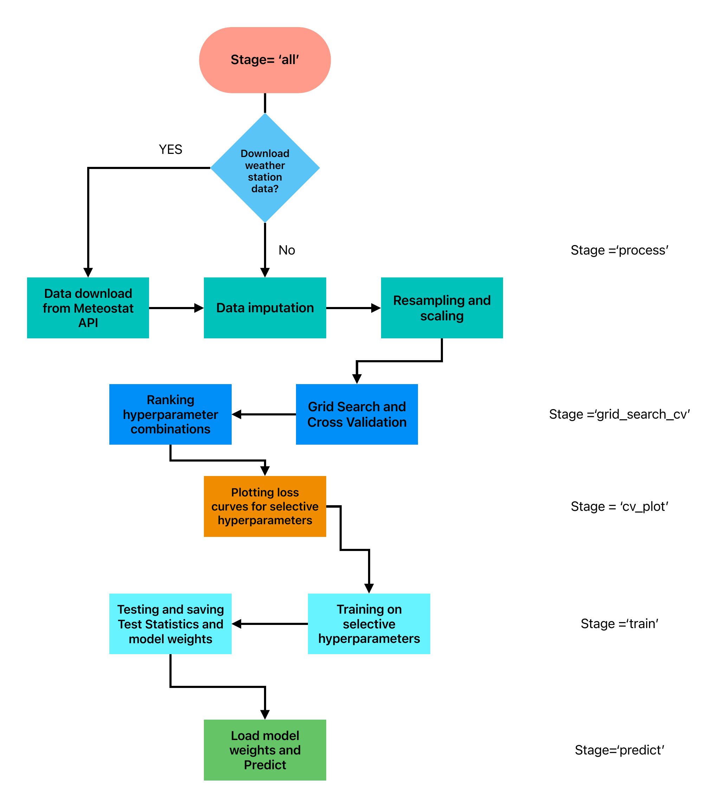
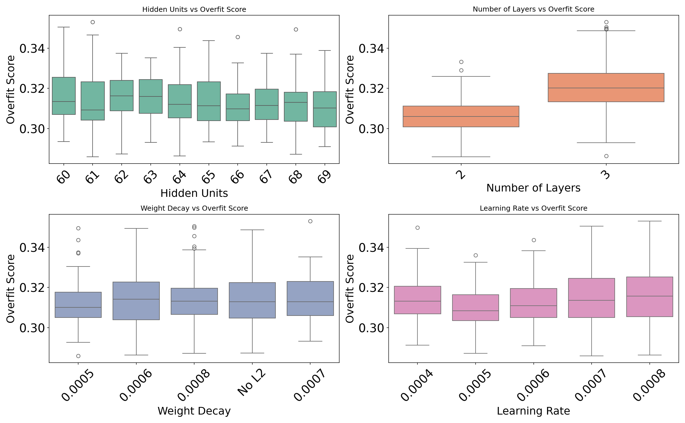
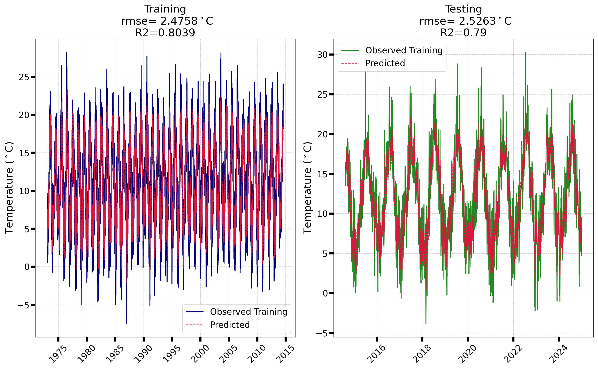

# LSTM model for station level Temperature prediction

This repository presents a modular, production-ready pipeline built on Long Short-Term Memory (LSTM) networks for station-level temperature forecasting. The system automates data retrieval, preprocessing, hyperparameter tuning via cross-validation, model training, evaluation, and prediction in a streamlined workflow. Each stage uses separate scripts modularized and orchestrated via `main.py`.


---

## Table of Contents

- [Overview](#overview)
- [Skills Demonstrated](#skill_demo)
- [Installation](#installation)
- [Usage](#usage)
- [The Model](#model)
- [Pipeline Stages](#pipeline-stages)
- [Configuration](#configuration)
- [Input Requirements](#input-data-requirements)
- [Outputs](#outputs)
- [Logging and Error Handling](#logging-and-error-handling)
- [Sample Results](#sample-results)
- [Data Sources](#data-sources)
---

## Overview

The pipeline leverages the [Meteostat API](https://dev.meteostat.net/) to retrieve hourly meteorological data for a specified station. It supports:

- Multiple strategies for handling missing data, including climatology-based, interpolation-based, or a hybrid approach that adapts based on the length of missing data gaps.
- Smart normalization and wind speed decomposition (`u/v`).
- Expanding-Window cross-validation with hyperparameter grid search.
- Plotting of Loss curves for selective hyperparameter combos depending on a specialised ranking scheme.
- Training, testing, and inference.


Each step is orchestrated through a single CLI interface via `main.py`.
## 💡 Skills Demonstrated

- Time Series Forecasting using LSTM Networks
- Walk-Forward Expanding Window Cross-Validation
- Smart Handling of Missing Meteorological Data
- Hyperparameter Optimization via Grid Search
- Scalable ML Pipeline Design (YAML-based configs)
- CLI-Driven Modular Codebase for Reusability
- Model Evaluation using RMSE, R² and Visualization

### What is an LSTM?

The core forecasting engine is an LSTM neural network implemented in PyTorch, selected for its proven ability to capture long-range temporal dependencies in weather patterns. Unlike traditional neural networks, LSTMs are well-suited for time series forecasting tasks because they can retain information over long sequences and handle temporal dependencies. This makes them ideal for predicting variables like temperature, where current values depend heavily on previous trends.

## Installation

1. **Clone the repository**
   ```bash
   git clone https://github.com/sayan-geoDL/lstm-weather-pipeline.git
   cd station-temp-lstm-pipeline
   ```
2. **(Optional) Create a virtual environment**
   ```bash
   python -m venv venv
   source venv/bin/activate  # Linux/macOS
   venv\Scripts\activate     # Windows
   ```
3. **Install Dependencies**
   ```bash
   pip install -r requirements.txt
   ```
## Usage
 ```bash
 python main.py --config config.yaml --stage [process|grid_search_cv|cv_plot|train|predict|all]
 ```
### Stages
| Stage           | Description                                   |
|-----------------|-----------------------------------------------|
| `process`       | Download, preprocess, and scale the data      |
| `grid_search_cv`| Run cross-validation with hyperparameter tuning |
| `cv_plot`       | Plot training loss for selected CV rank       |
| `train`         | Train final model and evaluate on test set    |
| `predict`       | Predict for future unseen dates               |
| `all`           | Runs all stages sequentially                  |
## The Model
This is an LSTM Model, which will take in `n_step` number of look back days to predict the average temperature of the next day in that station. It is advised to the user to consider the geographical location of the station , what kind of weather patterns exist, and then decide on the appropriate `n_step`. Once trained, the model can accept input sequences of varying lengths, but it is best to stick to the `n_step` it is trained for.
<p align="center">
  
</p>

<p align="center"><em>Figure 1: Schematic representation of the model structure.</em></p>

## Pipeline Stages

<p align="center">
  
</p>

<p align="center"><em>Figure 2: Schematic representation of the pipeline.</em></p>


1. **Data Preprocessing (`process`)**
   - Downloads hourly data for training/testing/prediction periods.
   - Resamples to hourly, fills missing data (`interpolate`, `climatology`, or `smart`).
   - When `smart` is used in the `filling_parameters` section `type` subsection of the config file, user needs to provide the `gap_threshold` parameter where it will fill with climatology when gaps in the missing data is more than the `gap_threshold` and will fill with interpolation if gap is less than `gap_threshold`
   - Computes `u`, `v` wind components from `wspd` (wind speed) and `wdir` (wind direction) columns.
   - Converts hourly to daily resolution.
   - Saves climatology from training data for filling of predicted or testing data.

2. **Data Scaling (part of `process` stage)** 
   - Normalizes wind magnitude up to a specified percentile (given by user). This is done to preserve and enhance the model to derive sense from wind speed and direction and its consequences on
     temperature. 
   - Applies z-score scaling on other variables.
   - Stores scaling parameters (in `scaling_params.csv`) from the training data.
   - Reuses these parameters for scaling test/prediction data and for inverse-transforming temperature outputs to real-world scale.

3. **Cross-Validation and Grid Search (`grid_search_cv`)**
   - Performs walk-forward expanding window cross-validation over the training data.
   - Tunes hyperparameters (e.g., learning rate, number of layers, hidden size, weight decay) using a grid search.
   - The performance of each combination of the grid search parameters are evaluated using a custom `overfit_score` given by:
     ```python
     overfit_score = val_mse + (0.5 * abs(val_mse - train_mse)) / train_mse
     ```
   - Plots the box plot of the `overfit_score` for each grid parameters and saves them to `./plots/performance_boxplots.png`. Thereafter the user can choose other hyperparameter grids depending on
     the plots for further fine tuning of the grid and then decide upon a final combination of hyperparameters for training.
   - Save the combinations of hyperparameters to `./out/train_test/cv_result.csv` ranked according to lowest to highest overfit scores.
4. **Plot of cross validation results (`cv_plot`)**
   - Plots the training and validation loss curves for each fold for a selected rank of model hyperparameters specified in `plot_cv_rank` by the user.
   - This helps in visually determining whether any kind of overfitting is still present and then the user can move on to the training phase or go back to the grid search phase for further tuning of
     hyperparameters
5. **Training(`train`)**
   - Trains the model with selected rank of hyperparameter combination or a user defined hyperparameter on the full training data and saves it to `./out/final_model.pth`
   - Evaluates on test data and evaluate root mean square error and R² values
   - Plots the distribution of predicted and observed temperature data and stores it to `./plots` directory.
   - Stores the test summaries to `./out/train_test/test_summary.csv` and the train and test predictions to `./out/train_test/train_ts.csv` and `./out/train_test/test_ts.csv` respectively.
6. **Prediction(`predict`)**
   - Predicts Temperature from the prediction dataset and stores it to `./out/predicted.csv`
## Configuration
The pipeline requires a config.yaml file to specify input data paths, training parameters, and output directories.

Below is a sample structure of config.yaml:
```
# === 1. Data Download Configuration ===
download_data: true   # Set to true to download fresh data, false to skip
station_id: '03772'
# === 2. Date Ranges ===
dates:
  train:
    start: '1973-01-01'
    end: '2014-08-07'
  test:
    start: '2014-08-08'
    end: '2020-12-31'
  predict:
    start: '2021-01-01'
    end: '2024-12-31'
# ===3. Filling of missing values
filling_parameters:
  type: 'smart'        # filling missing data by either 'climatology', 'interpolate' or 'smart'
  gap_threshold: 4     # if type is smart then if continuous gap below gap_threshold will be filled by interpolation if above gap_threshold will use climatology
# === 4. Scaling Configuration ===
scaling:
  magnitude_threshold_percent: 99.5  # Threshold percentile for wind magnitude

# === 5. Grid Search Hyperparameters and cross validation ===
# Accepts either lists ( [a, b, c] ) or tuples ( (a, b, c) ) in YAML
input_window: 8 # look back time for the LSTM model
fold_no: 5 # No of folds for expanding window cross validation
epochs: 300 # Number of epochs for each cross validation testing
validation_size: 10 # percentage of training data used for validation (default is 10 %)
early_stop: 15 # early stopping patience , default is 10
device: 'cuda' # to use 'cpu' or 'cuda' for gpu
grid_search:
  learning_rate: [0.0001, 0.0005, 0.001]     # Can also be (0.0001, 0.0005, 0.001)
  weight_decay: (0.0, 0.0015, 0.0005)        # Treated as tuple if parentheses used can use list and put None for no L2 Regularisation
  hidden_size: [32, 64, 128]
  num_layers: (1, 3, 1)


# === 6. Cross-validation Result Selection ===
plot_cv_rank: 1  # Rank from CV results to be plotted

# === 7. Training Model Configuration ===
training:
  use_rank: true  # If true, 'rank' below will be used. If false, use individual params below.
  rank: 5  # Rank to use from CV results if 'use_rank' is true

  # Used only if 'use_rank' is false
  params:
    learning_rate: 0.0005
    weight_decay: 0.0005
    hidden_size: 64
    num_layers: 2

# === 8. Prediction Toggle ===
run_prediction: true  # Set to false to skip prediction
```
## Input Requirements
- Meteostat station ID: Should be valid for the region of interest.

- Automatically downloads:
  `temp`(temperature), `dwpt`(dewpoint temperature), `pres` (pressure), `rhum` (relative humidity), `wspd` (windspeed), `wdir` (wind direction) (hourly)
  Converted to:
  `temp`, `dwpt`, `pres`, `rhum`, `u`, `v` (daily)
- If user wants to use own data, they can put the data in csv format with the above column with appropriate time index column in the `./data` directory as `station_train_test.csv` and 
  `station_predict.csv`
## Outputs
| Output File          | Description                                   |
| -------------------- | --------------------------------------------- |
| `train_test_daily.csv`| Processed daily data for training and testing|
| `predict_daily.csv`  | Processed daily data for prediction            |
| `train_scaled.csv`   | Scaled training data                          |
| `test_scaled.csv`    | Scaled test data                              |
| `predict_scaled.csv` | Scaled prediction data                        |
| `scaling_params.csv` | Stored mean/std for normalization             |
| `cv_stats.csv`       | CV scores for all hyperparameters             |
| `model_state.pth`    | Saved trained LSTM model                      |
| `train_ts.csv`       | Observed and predicted values of training     |
| `test_ts.csv`        | Observed and predicted values of testing      |
| `test_summary.csv`   | Summary of training and test statistics       |
| `predicted.csv`      | Final predictions (if run\_prediction = true) |
| `plots/`             | Loss curves, box plots, performance charts    |
| `main.log`           | Full pipeline logs                            |
## Logging and Error Handling
- The pipeline uses Python’s built-in logging module to record runtime information, warnings, and errors.

- Logs provide detailed progress updates for each pipeline stage (cv, train, predict) and help with troubleshooting.

- Log messages include timestamps and log levels (INFO, WARNING, ERROR).

- If an error occurs, the pipeline outputs meaningful messages and exits gracefully to avoid corrupted outputs.

- Logs are saved to `./main.log` , making it easy to review pipeline execution details.
## Sample Results
The following is a sample result using `n_step=8 days` and a 5 fold walk-forward, expanding window cross validation approach.
<h2 id="sample-results">📊 Sample Output Plots</h2>

<p align="center">
  
</p>

<p align="center"><em>Figure 3: Box plots for the various parameters fed to the grid search.</em></p>

<p align="center">
  
</p>

<p align="center"><em>Figure 4: Histogram comparison of predicted vs. observed temperatures for both training and testing phases.</em></p>

<p align="center">
  
</p>

<p align="center"><em>Figure 5: Time series of observed vs. predicted temperature for the training and testing periods .</em></p>

## Data Sources

This project uses historical weather data from [Meteostat](https://meteostat.net), retrieved via their [Python API](https://dev.meteostat.net/python/).  
The data itself is **not included** in this repository to keep it lightweight and to comply with data licensing policies.

### Referenced Dataset

- **Station:** London Heathrow Airport (EGLL)  
- **Source:** [Meteostat Station Data](https://meteostat.net/en/station/03772)
