# Physics-Aware ML Pipeline for Station-Level Forecasting

This repository presents a **modular, production-ready pipeline** for station-level forecasting using a **custom predictor model with physics-aware loss integration**. The system automates data retrieval, preprocessing (with smart data gap handling), scaling, hyperparameter tuning via cross-validation, model training, ensemble mode support, evaluation, and prediction.

The framework is designed for **insurance and reinsurance applications**, where predictive accuracy, transparency, and physical plausibility are critical for risk modeling, claims forecasting, and exposure management.

---

## Table of Contents

- [Overview](#overview)
- [💡 Skills Demonstrated](#skills-demonstrated)
- [Installation](#installation)
- [Usage](#usage)
- [Project structure](#project-structure)
- [The Model](#the-model)
- [Pipeline Stages](#pipeline-stages)
- [Configuration](#configuration)
- [Input Requirements](#input-requirements)
- [Outputs & File Savings](#outputs--file-savings)
- [Logging and Error Handling](#logging-and-error-handling)
- [Sample Results](#sample-results)
- [Data Sources](#data-sources)
- [Notes on Implementation](#notes-on-implementation)
- [References](#references)
- [Third-Party Licenses ](#third-party-licenses)

---

## Overview

The pipeline is built for **robust and explainable predictive modeling**, supporting:

- **Smart data gap handling** using adaptive methods (interpolation or climatology depending on gap size).
- **Hybrid scaling scheme**:
  - Standardization (z-score) for most predictors.
  - Specialized wind magnitude normalization to ensure physically meaningful feature scaling.
- **Physics-aware custom loss function**, enforcing physical consistency in forecasts.
- Expanding-window cross-validation with hyperparameter optimization.
- Transparent performance reporting and visualization.
- **Ensemble mode** for model ensembles, with optional EMOS post-processing placeholders.
- Extensibility for **EMOS (Ensemble Model Output Statistics)** post-processing via placeholders.

Each step is modularized and orchestrated via `main.py`.

---

## 💡 Skills Demonstrated

- Time Series Forecasting with Custom Neural Predictors (LSTM-based sequence model)  
- Model Architecture Design & Visualization (LSTM encoder → dense regression head → multi-output forecasting)  
- Walk-Forward Expanding Window Cross-Validation  
- Smart Handling of Missing Meteorological Data (interpolation, climatology, adaptive)  
- Physics-Aware Loss Function Design  
  - Integration of domain equations (Buck’s formula for RH) into loss  
  - Hybrid objective combining **MSE** + **physics-consistency penalty**  
- Hybrid Scaling with Domain-Specific Treatment of Wind Magnitudes  
- Hyperparameter Optimization with Automated Reporting (TPE-based tuning, Pareto ranking)  
- Ensemble Modeling & Post-processing (single vs ensemble, bootstrap uncertainty quantification, EMOS-ready)  
- Scalable ML Pipeline Design (CLI-driven modular codebase with serial or staged execution)  
- Model Evaluation using RMSE, R², and domain-specific physical consistency checks  
- Business-Relevant Applications in Insurance & Reinsurance (risk forecasting, catastrophe modeling, exposure prediction)  
---

## Installation

1. **Clone the repository**
   ```bash
   git clone https://github.com/sayan-geoDL/physaware-lstm-forecast
   cd station-physics-aware-pipeline
   ```
3. **Install Dependencies**
   ```bash
   pip install -r requirements.txt
   ```
## Usage
  ```bash
  python main.py --config config.yaml --stage [process|optimize_cv|train|predict|all]
  ```
## Project Structure

```
├── main.py                     # Main pipeline orchestrator
├── station_process.py          # Downloading and data imputation
├── station_cv.py               # Cross-validation and hyperparameter optimization
├── station_trainer.py          # Model training and evaluation
├── station_predict.py          # Prediction and forecasting
├── station_model_util.py       # Core model definitions and utilities
├── station_scaler.py           # Data preprocessing and scaling
├── station_extra_utilities.py  # Helper functions and reporting
├── config.yaml                 # Configuration file (user-created)
├── main.log                    # Runtime pipeline logs (created here)
├── data/                       # Data directory
│   └── processed/              # Processed and scaled data
├── out/                        # Runtime outputs
│   ├── models/                 # Trained model weights
│   ├── train_test/             # Training and testing results
│   └── predictions/            # Forecast outputs
├── plots/                      # Auto-generated plots
│   ├── cv/                     # Cross-validation plots
│   └── train/                  # Training and evaluation plots
└── assets/                     # 📊 Curated plots for README

```


## Stages

| Stage            | Description                                                                 |
|------------------|-----------------------------------------------------------------------------|
| **`process`**    | Retrieve raw station data, apply **smart gap handling** (interpolation vs. climatology), resample to daily resolution, and scale features using **z-score normalization** and **wind magnitude thresholding**. |
| **`optimize_cv`**| Perform **cross-validation with hyperparameter optimization** using a **TPE Sampler**. Outputs ranked parameter sets, loss curve plots, and a comprehensive **performance report (PDF)** for transparent model selection. |
| **`train`**      | Train the final model(s) in either **single** or **ensemble** mode. Evaluates performance on both training and test datasets, saves model weights, produces diagnostic plots, and exports a structured **training report (PDF)**. |
| **`predict`**    | Run inference on unseen future data. Saves deterministic forecasts for single models or **probabilistic predictions with uncertainty spreads** when ensemble mode is enabled. |
| **`all`**        | Executes the **full workflow sequentially**: preprocessing → CV optimization → training → prediction, generating all intermediate files, plots, and reports. |

## The Model

The core forecasting engine is an **LSTM-based predictor** implemented in PyTorch and designed for configurability and reproducibility.

**Input / Output**  
- **Inputs (per sample)**: a sequence of `n_step` daily timesteps with 6 features:  
  `[dwpt, temp, rhum, pres, u, v]` (shape: `(batch_size, n_step, 6)`).
- **Targets (per sample)**: next-day forecasts for four variables:  
  `[dwpt, temp, rhum, pres]` (shape: `(batch_size, 4)`) for `t+1`.

**Architecture (high-level)**  
- Configurable multi-layer **LSTM** (hyperparameters: `n_step`, `hidden_size`, `num_layers`, `dropout`).  
- The LSTM processes the input sequence and the **final hidden state** (or sequence pooling) is passed to a small fully-connected head that maps to the 4-dimensional output vector.  
- Output layer is linear (suitable for regression on meteorological variables).  
- All inputs are scaled (z-score for most features; wind magnitude handled specially) and outputs are inverse-transformed for reporting.

**Humidity / Physics handling**  
- **Relative humidity (`rhum`) is defined and computed using Buck’s formulation of saturation vapor pressure** [Buck, 1981](#references): in the pipeline `rhum` is derived as  
  `rhum = e_s(dwpt) / e_s(temp)`  
  where `e_s(·)` is the saturation vapour pressure computed using Buck’s formula. `rhum` is used as both an input feature and a target variable.  
- The codebase includes a lightweight physics-consistency option: when enabled, the training objective can include an additional penalty that enforces consistency between the model’s predicted `temp`/`dwpt` and `rhum` computed from those predictions (i.e., a humidity-consistency term based on Buck’s relation). This keeps the model outputs physically coherent while still optimizing standard regression loss.

**Loss & Training**  
- Primary objective: **MSE** (or equivalent regression loss) on the target vector `[dwpt, temp, rhum, pres]`.  
- Optional additive physics-consistency penalty (as described above) can be toggled in configuration.  
- Training is done after consistent scaling; final model weights and metadata are saved for reproducibility.

**Ensemble / Bootstrap**  
- Ensemble functionality is supported via an **ensemble mode** (multiple members trained with different seeds/hyperparameters).  
- `bootstrap_ci` currently acts as a **placeholder** for ensemble post-processing (EMOS / probabilistic calibration) and can be extended to produce calibrated probabilistic forecasts and prediction intervals in the future.

```mermaid
flowchart TB
    %% ===================== Model =====================
    subgraph M["LSTM-based Predictor"]
        direction TB
        IN(["Input Sequence<br/>(batch, n_step, 6[dwpt,temp,rhum,pres,u,v])"]):::model
        LSTM["LSTM Layers<br/>(num_layers, hidden_size)"]:::model
        FC["Fully Connected Layer<br/>(hidden_size → 4)"]:::model
        OUT["Predicted Outputs<br/>[dwpt, temp, rhum, pres]"]:::model

        IN --> LSTM --> FC --> OUT
    end

    %% ===================== Physics-aware Loss =====================
    subgraph L["Physics-aware Loss Function"]
        direction TB
        YP["Predicted Outputs"]:::loss
        YT["Ground Truth Outputs"]:::loss

        MSE["MSE Loss<br/>(y_pred vs y_true)"]:::loss

        DWPT["Unscale dwpt"]:::loss
        TEMP["Unscale temp"]:::loss
        RHUM_P["Predicted rhum"]:::loss
        RHUM_PHYS["Physics RH = f(temp, dwpt)<br/>es_water equations"]:::loss

        PHYS_LOSS["Physics Loss<br/>MSE(rhum_pred, rhum_phys)"]:::loss

        TOTAL["Total Loss<br/>MSE + λ·PhysicsLoss"]:::loss

        YP --> MSE
        YT --> MSE

        YP --> DWPT --> RHUM_PHYS
        YP --> TEMP --> RHUM_PHYS
        YP --> RHUM_P --> PHYS_LOSS
        RHUM_PHYS --> PHYS_LOSS

        MSE --> TOTAL
        PHYS_LOSS --> TOTAL
    end

    %% ===================== Data Flow =====================
    OUT --> YP

    %% ===================== Styling =====================
    classDef model fill:#FFFFFF,stroke:#1565C0,stroke-width:3px,color:#0D47A1,font-weight:bold
    classDef loss fill:#FFFFFF,stroke:#E65100,stroke-width:3px,color:#BF360C,font-weight:bold
    style M fill:none,stroke:#1565C0,stroke-width:2px
    style L fill:none,stroke:#E65100,stroke-width:2px

```

**Shapes / Example**
```python
# Example shapes
X.shape  # -> (batch_size, n_step, 6)    # [dwpt,temp,rhum,pres,u,v]
y.shape  # -> (batch_size, 4)             # [dwpt,temp,rhum,pres] for t+1
```
1. **Data Preprocessing (`process`)**

   - **Data aggregation**: Downloads or ingests station-level hourly meteorological data and resamples it to daily resolution.  
   - **Gap handling**: Missing values are treated using a configurable strategy defined in the `config.yaml`:  
     - *Interpolation* for short gaps.  
     - *Climatology-based filling* for longer gaps (using historical seasonal averages).  
     - Or a fixed choice of either method if preferred.  
   - **Feature engineering**: Computes wind vector components (`u`, `v`) from wind speed and wind direction.  
   - **Scaling scheme** (feature-specific):  
     - `[dwpt, temp, pres]` → standardized using z-score scaling.  
     - `rhum` → rescaled from `[0, 100]` (%) to `[0, 1]`.  
     - `[u, v]` → scaled relative to a wind magnitude percentile threshold (configurable).  
   - **Outputs**:  
     - Processed and scaled daily datasets saved to `./data/processed/` for training, testing, and prediction.  
     - Scaling parameters (mean, std, thresholds) saved to `./data/processed/scaling_params.csv` for reproducibility and inverse transformations.  
2. **Cross-Validation and Hyperparameter Optimization (`optimize_cv`)**

   - **Methodology**:  
     - Uses **walk-forward expanding window cross-validation** with fold-aware weighting.  
     - Hyperparameter search is performed via a **TPE (Tree-structured Parzen Estimator) sampler**. Early stopping mechanism used to reduce cross validation process time.
     - At this stage user can either chose to evaluate performance with physics without physics or both by setting `physics_mode` respectively `'none'`,`'with'` or `'both'`  
   - **Optimization objectives**:  
     - `mean_rmse`: fold-averaged validation RMSE.  
     - `overfit_score`: defined as  
       `overfit_score = |train_loss - val_loss| / train_loss`
   - **Model ranking**:  
     - Candidate models are ranked on the **Pareto front** defined by (`mean_rmse`, `overfit_score`).  
     - Final ranking is based on the **Cartesian distance from the origin** in this two-metric space.  
   - **Outputs**:  
     - Ranked parameter sets saved to `./out/train_test/cv_result.csv`.  
     - Visualizations (loss curves, CV diagnostics) saved to `./plots/cv/`.  
     - A comprehensive **cross-validation report (PDF)** generated at `./out/train_test/cv_report.pdf`.
## Training (`train`)

The training stage supports both **single-model** and **ensemble** workflows, with automatic evaluation, plotting, and report generation.

---

### 1. Single Model Mode
- Trains the Predictor model using either:
  - User-defined hyperparameters, or  
  - A selected CV-ranked configuration from `cv_result.csv`.  
- Produces **training and validation loss curves** for monitoring convergence.  
- Saves the trained model weights to:  
  - `./out/models/final_model.pth`  
- Stores predictions on both training and test sets:  
  - `./out/train_test/train_ts.csv`  
  - `./out/train_test/test_ts.csv`  
- Evaluates model performance:  
  - Computes **R²** and **RMSE** per output variable (on both training and test sets).  
  - Results saved to `./out/train_test/metrics.csv`.  
- Generates plots of observed vs. predicted distributions and time series.

---

### 2. Ensemble Mode
- Trains multiple models based on a chosen set of ranked hyperparameter configurations from `cv_result.csv`.  
- Produces **loss curves** for each ensemble member.  
- Saves trained model weights to:  
  - `./out/models/rank{r}_model.pth` (where `{r}` is the CV rank).  
- Stores predictions for each member model:  
  - `./out/train_test/rank{r}_train_ts.csv`  
  - `./out/train_test/rank{r}_test_ts.csv`  
- Computes the **ensemble mean prediction** across members and a **percentile-based uncertainty spread**:  
  - Results saved to `./out/train_test/ensemble_train_ts.csv` and `./out/train_test/ensemble_test_ts.csv`.  
- Evaluates ensemble performance:  
  - Computes **R²** and **RMSE** per output variable for all members and the ensemble mean.  
  - Results saved to `./out/train_test/ensemble_metrics.csv`.  
- Generates comparative plots of observed values, individual members, and ensemble mean predictions.

---

### 3. Report Generation
- Produces a comprehensive PDF summarizing training results:  
  - `./out/train_test/single_model_report.pdf` (for single mode).  
  - `./out/train_test/ensemble_report.pdf` (for ensemble mode).  
- Reports include:
  - Training/test performance metrics.  
  - Loss curve visualizations.  
  - Prediction vs. observation comparisons.  
  - Ensemble spread analysis (if applicable).

## Prediction (`predict`)

The prediction stage generates forecasts on unseen (future) datasets, supporting both **single-model** and **ensemble** modes.

---

### 1. Single Model Mode
- Runs inference using the trained Predictor model.  
- Saves deterministic forecasts to:  
  - `./out/predictions/single_prediction.csv`  

---

### 2. Ensemble Mode
- Runs inference for each ensemble member, saving outputs to:  
  - `./out/predictions/rank{r}_prediction.csv` (where `{r}` is the CV rank of the model).  
- Computes and saves the **ensemble mean forecast** along with **percentile-based uncertainty bounds** to:  
  - `./out/predictions/ensemble_prediction.csv`  

---

### 3. Outputs
- All prediction files include both the **forecasted variables** and associated **timestamps** for traceability.  
- Ensemble outputs provide an **uncertainty spread** (e.g., 5th–95th percentile) to quantify forecast confidence.

## Configuration

The pipeline requires a `config.yaml` file that specifies:  
- **Training parameters** (epochs, early stopping, device, etc.).  
- **Hyperparameter optimization search space** (for TPE-based tuning).  
- **Mode of operation** (`single` or `ensemble`).  
- **Preprocessing settings** (gap handling strategies, scaling thresholds).  
- **Prediction settings** (device, uncertainty quantiles, bootstrap samples).  

---


### Example `config.yaml`

```yaml
# === 1. Data Download Configuration ===
download_data: true       # Set to true to fetch new data, false to reuse local files
station_id: ''       # Station identifier
lookback: 8               # Number of past days to use for prediction

# === 2. Date Ranges ===
dates:
  train:
    start: '1990-01-01'
    end: '2017-03-23'
  test:
    start: '2017-03-24'
    end: '2023-12-31'
  predict:
    start: '2024-01-01'
    end: '2024-12-31'

# === 3. Missing Value Handling ===
filling_parameters:
  type: 'smart'           # Options: 'climatology', 'interpolate', 'smart'
  gap_threshold: 4        # For 'smart': gaps ≤ threshold → interpolate, > threshold → climatology

# === 4. Scaling Configuration ===
scaling:
  wind_threshold_percent: 95   # Percentile threshold for wind magnitude scaling

# === 5. Hyperparameter Optimization and Cross Validation ===
hyper_optim:
  device: "cuda"          # Options: "cpu" or "cuda"
  n_trials: 200           # Number of optimization trials
  njobs: 4                # Parallel jobs (CPU only)
  physics_mode: both      # Options: none | with | both
  val_size: 10            # Validation size (%)
  k_folds: 7              # Number of CV folds
  epochs: 300             # Training epochs per trial
  es_patience: 25         # Early stopping patience (epochs)

  search_space:           # TPE sampler search space
    hidden_size:
      type: int
      low: 1
      high: 130
      step: 1
    num_layers:
      type: int
      low: 1
      high: 3
      step: 1
    learning_rate:
      type: float
      low: 1e-4
      high: 0.1
      log: true
    weight_decay:
      type: float
      low: 1e-4
      high: 1.0
      log: true
    lambda_physics:
      type: float
      low: 1e-4
      high: 10.0
      log: true

  rank: 'all'             # Options: 'all' | list (e.g. [1,3,5]) | tuple (start, end, step)

# === 6. Training Configuration ===
training:
  mode: 'single'          # Options: 'single' or 'ensemble'
  use_rank: true          # If true → use ranked config below; if false → custom params
  rank: 1                 # For single mode: integer rank
                          # For ensemble mode: tuple (start,end,step) or list

  hold_out: 12            # % of data held out for early stopping
  epochs: 500
  es_patience: 25         # Early stopping patience (epochs)
  device: "cuda"

  # Used only if 'use_rank' is false (manual override)
  params:
    learning_rate: 0.0005
    weight_decay: 0.0005
    hidden_size: 64
    num_layers: 2
    lambda_physics: 1.25

  # Ensemble mode bootstrap settings
  B: 1200                 # Number of bootstrap samples
  low: 2.5                # Lower percentile for uncertainty bounds
  high: 97.5              # Upper percentile for uncertainty bounds

# === 7. Prediction Configuration ===
prediction:
  run_prediction: true
  device: "cuda"
  B: 1000                 # Bootstrap samples for uncertainty in ensemble mode
  low: 2.5                # Lower percentile for uncertainty bounds
  high: 97.5               # Upper percentile for uncertainty bounds
```
## Input Requirements

- **Data sources**: Meteorological or climate-related **station-level datasets** containing at least:  
  `temperature`, `dew point (dwpt)`, `pressure (pres)`, `relative humidity (rhum)`, `wind speed (wspd)`, and `wind direction (wdir)`.  
- **Acquisition**: Data can be retrieved automatically (e.g., via Meteostat) or supplied manually as CSVs with matching column names.  
- **Preprocessing**: Missing values and feature scaling are handled automatically according to the configuration.  

---
## Outputs & File Savings

All runtime outputs are systematically organized under `./out/` and `./data/` for **reproducibility**, **auditability**, and **ease of review**.  
Below is a directory-wise summary of the key files and their purposes.

---

### `./data/`
- `station_train_test.csv` — raw hourly training and testing data  
- `train_test_daily_filled.csv` — hourly training and testing data with missing values filled  
- `station_predict.csv` — raw hourly prediction dataset  
- `predict_daily_filled.csv` — hourly prediction dataset with missing values filled  
- `climatology.csv` — hourly climatology reference, used for climatology-based gap filling  

---

### `./data/processed/`
- `train_test_daily.csv` — daily-aggregated and preprocessed training + test data  
- `train_scaled.csv` — scaled daily training data  
- `test_scaled.csv` — scaled daily test data  
- `predict_daily.csv` — daily-aggregated and preprocessed prediction data  
- `predict_scaled.csv` — scaled daily prediction inputs  
- `scaling_params.csv` — scaling parameters (mean, std, wind thresholds) for reproducibility and inverse transforms  

---

### `./out/train_test/`
- **Cross-validation outputs**  
  - `cv_result.csv` — ranked hyperparameter sets (Pareto front by RMSE & overfit score)  
  - `cv_report.pdf` — comprehensive CV report with diagnostics and plots  

- **Single-model outputs**  
  - `train_ts.csv` — training set predictions vs. observations  
  - `test_ts.csv` — test set predictions vs. observations  
  - `metrics.csv` — R² and RMSE metrics for both training and test sets  
  - `single_model_report.pdf` — complete single-model training report  

- **Ensemble outputs**  
  - `rank{r}_train_ts.csv` — training predictions for ensemble member `{r}`  
  - `rank{r}_test_ts.csv` — test predictions for ensemble member `{r}`  
  - `ensemble_train_ts.csv` — ensemble mean + percentile-based uncertainty spread (training set)  
  - `ensemble_test_ts.csv` — ensemble mean + percentile-based uncertainty spread (test set)  
  - `ensemble_metrics.csv` — R² and RMSE metrics for all members and the ensemble mean  
  - `ensemble_report.pdf` — complete ensemble training report  

---

### `./out/models/`
- `final_model.pth` — trained single-model weights  
- `rank{r}_model.pth` — trained ensemble member weights  

---

### `./out/predictions/`
- `single_prediction.csv` — forecasts from the trained single model  
- `rank{r}_prediction.csv` — forecasts from ensemble member `{r}`  
- `ensemble_prediction.csv` — ensemble mean forecasts + percentile-based uncertainty spread  

---

### `./plots/cv/`
- `rank{r}_fold_{k}.png` — training vs. validation loss curves for model `{r}`, fold `{k}`  
- `scatters.png` — scatter plot of mean overfit scores vs. mean RMSE, color-coded by hyperparameters  

---

### `./plots/train/`
- **Single-model plots**  
  - `train_val_loss.png` — training and validation (hold-out) loss curves  
  - `distributions.png` — observed vs. predicted distributions (training and test sets)  
  - `time_series.png` — observed vs. predicted time series (training and test sets)  

- **Ensemble plots (per member + aggregated)**  
  - `rank{r}_train_val_loss.png` — training/validation loss curves for member `{r}`  
  - `rank{r}_distributions.png` — observed vs. predicted distributions (ensemble member `{r}`)  
  - `rank{r}_time_series.png` — observed vs. predicted time series (ensemble member `{r}`)  

- **Ensemble aggregate plots**  
  - `ensemble_distributions.png` — observed vs. predicted distributions of the ensemble mean  
  - `ensemble_{var}_train_ts.png` — training set time series for variable `{var}` (`dwpt`, `temp`, `rhum`, `pres`) with percentile-based uncertainty spread  
  - `ensemble_{var}_test_ts.png` — test set time series for variable `{var}` with percentile-based uncertainty spread  

---
## Logging and Error Handling

- **Centralized logging**: All progress messages, warnings, and errors are captured via Python’s built-in logging framework and written to `./main.log`.  
- **Stage-specific detail**: Each pipeline stage (preprocessing, CV, training, prediction) records detailed runtime information for traceability.  
- **Robust error handling**:  
  - Failures trigger **graceful exits** to prevent corrupted outputs.  
  - Temporary files are written first and only **atomically renamed** upon successful completion, ensuring consistency and auditability.
## Sample Results

The following figures illustrate representative results using an `n_step = 8` day look-back window and **7-fold walk-forward expanding window cross-validation**.  
(Data location and station identifiers are omitted for licensing reasons.)

<p align="center">
  
  <br/>
  <em>Figure 1: Scatter plot of overfit score vs. RMSE for Pareto-optimal models, with color-coding by hyperparameters.</em>
</p>

<p align="center">
  
  <br/>
  <em>Figure 2: Distribution comparison of ensemble mean forecasts vs. observations on training and test sets.</em>
</p>

<p align="center">
  
  <br/>
  <em>Figure 3: Ensemble mean time series of dew point temperature on the test set, with quantile-based uncertainty bands.</em>
</p>

<p align="center">
  
  <br/>
  <em>Figure 4: Ensemble mean time series of temperature on the test set, with quantile-based uncertainty bands.</em>
</p>

<p align="center">
  
  <br/>
  <em>Figure 5: Ensemble mean time series of relative humidity on the test set, with quantile-based uncertainty bands.</em>
</p>

<p align="center">
  
  <br/>
  <em>Figure 6: Ensemble mean time series of surface pressure on the test set, with quantile-based uncertainty bands.</em>
</p>

---

## Data Sources

This project is designed to work with station level **meteorological and climate datasets**, such as:  
- Public sources (e.g., [Meteostat](https://meteostat.net))  
- Proprietary station-level datasets (e.g., automated weather station feeds), provided they use the expected variable naming conventions  

Data is **not bundled with the repository** due to licensing restrictions and file size considerations.

---

## Notes on Implementation

- **`bootstrap_ci`** — currently implemented as a placeholder for future **EMOS integration** (ensemble model output statistics / probabilistic calibration).  
- **`grid` function** — retained as a **legacy utility** for backward compatibility; not required in the current pipeline.  
## References

- Buck, A. L. (1981). *New Equations for Computing Saturation Vapor Pressure*.  
  Journal of Applied Meteorology and Climatology, **20**(12), 1527–1532.  
  [https://doi.org/10.1175/1520-0450(1981)020<1527:NEFCVP>2.0.CO;2](https://doi.org/10.1175/1520-0450(1981)020<1527:NEFCVP>2.0.CO;2)

## Third-Party Licenses

This project builds upon several open-source libraries. Each library is governed by its own license:

| Package       | Version Range | License      | License Link |
|---------------|---------------|--------------|--------------|
| **PyYAML**    | >=6.0,&lt;7.0    | MIT          | [PyYAML License](https://github.com/yaml/pyyaml/blob/main/LICENSE) |
| **matplotlib**| >=3.8,&lt;4.0    | Matplotlib License (BSD-compatible) | [Matplotlib License](https://matplotlib.org/stable/users/project/license.html) |
| **meteostat** | >=1.7,&lt;2.0    | MIT          | [Meteostat License](https://github.com/meteostat/meteostat-python/blob/main/LICENSE) |
| **numpy**     | >=1.26,&lt;2.0   | BSD-3-Clause | [NumPy License](https://numpy.org/doc/stable/license.html) |
| **optuna**    | >=4.4,&lt;5.0    | MIT          | [Optuna License](https://github.com/optuna/optuna/blob/master/LICENSE) |
| **pandas**    | >=2.2,&lt;3.0    | BSD-3-Clause | [Pandas License](https://pandas.pydata.org/docs/license.html) |
| **psutil**    | >=5.9,&lt;6.0    | BSD-3-Clause | [psutil License](https://github.com/giampaolo/psutil/blob/master/LICENSE) |
| **reportlab** | >=4.4,&lt;5.0    | BSD-3-Clause (free for open source) | [ReportLab License](https://www.reportlab.com/devfaq/#license) |
| **torch (PyTorch)** | >=2.6,&lt;3.0 | BSD-3-Clause | [PyTorch License](https://github.com/pytorch/pytorch/blob/main/LICENSE) |
